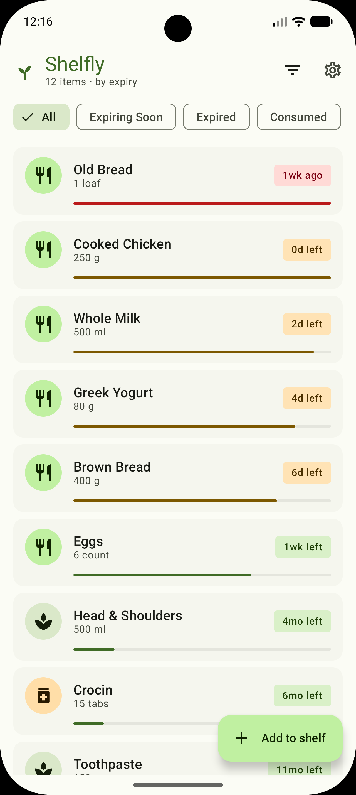
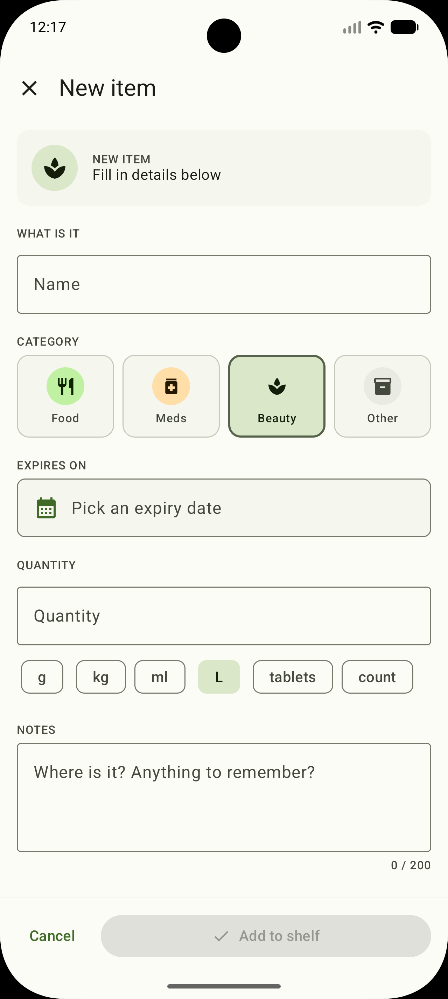
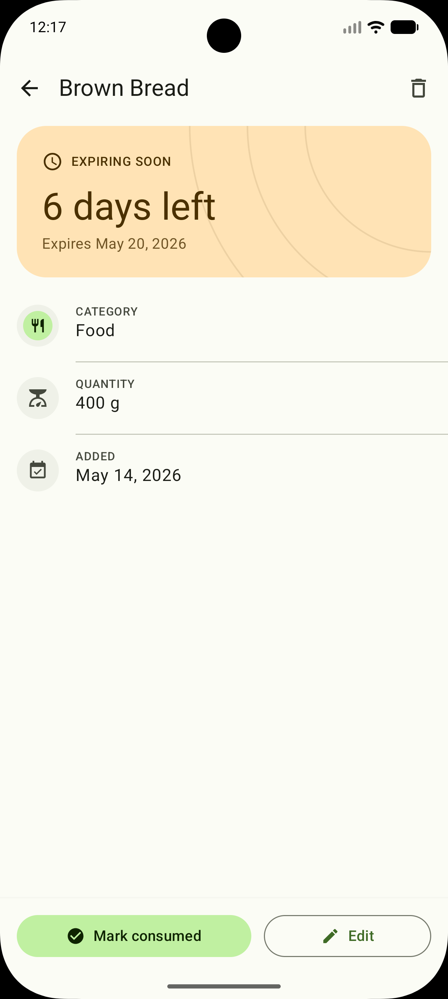
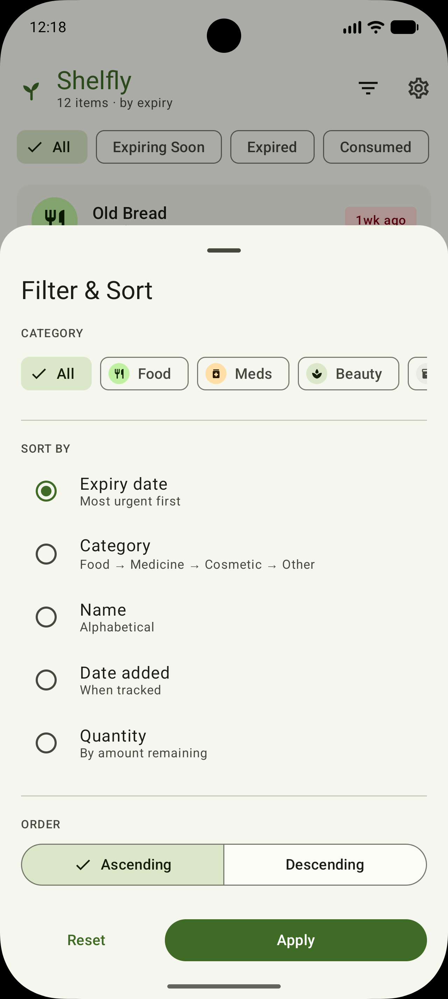
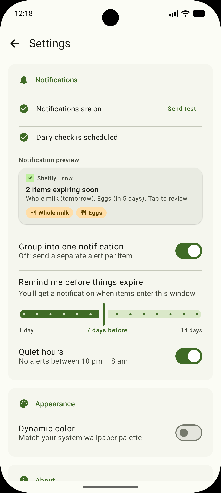
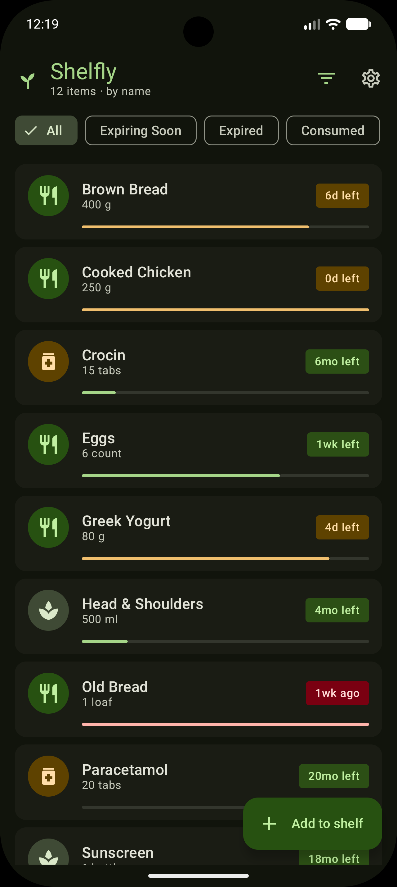
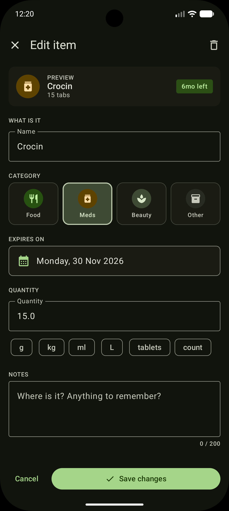
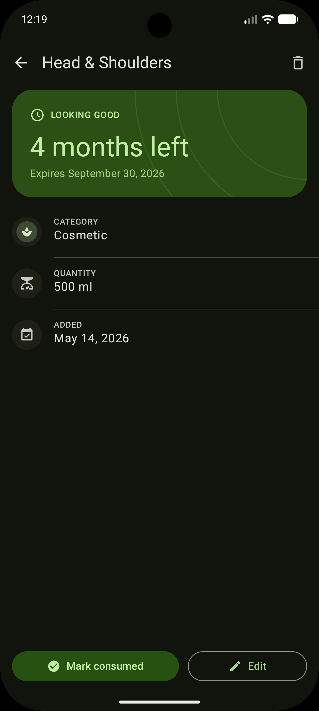
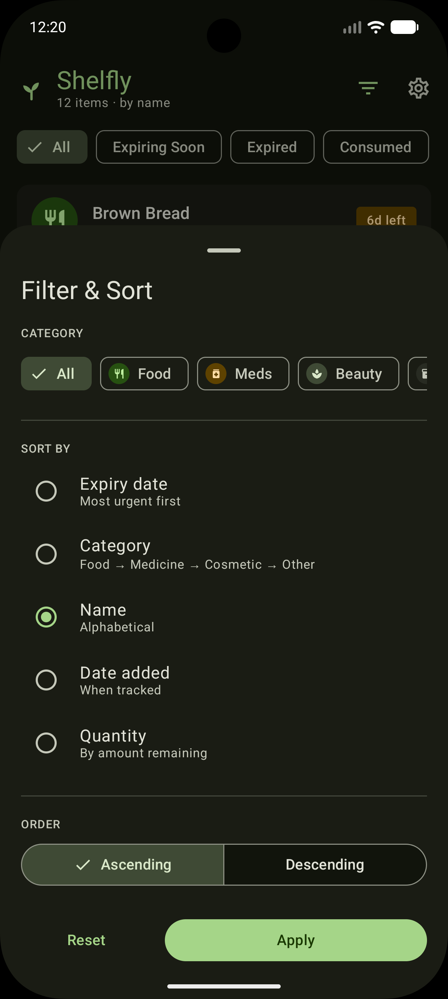
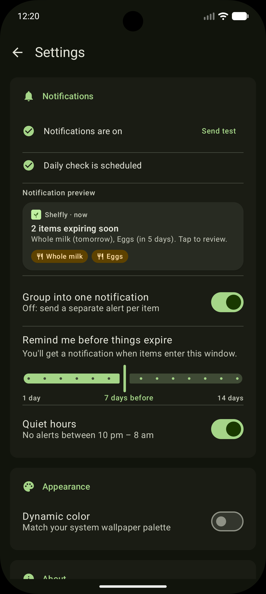

<p align="center">
  
</p>

<h1 align="center">Shelfly</h1>
<p align="center">Track expiry dates for food, medicine, and cosmetics — powered by Android AppFunctions</p>

<p align="center">
  
  
  
  
  
</p>

---

## What is Shelfly?

Shelfly is a minimal Android app for tracking when things on your shelf expire — groceries, medicines, skincare, and anything else with a best-before date. Instead of hunting through kitchen cabinets when you're already sick, you get a nudge before things go bad.

The differentiator: **Shelfly exposes its entire data surface as Android AppFunctions**, so Gemini (and any future on-device AI agent) can add, list, update, and delete items through natural conversation — no typing required.

---

## Features

### Core
- **Add items** with category (Food / Medicine / Cosmetic / Other), expiry date, quantity, and notes
- **Status-aware home screen** — items are colour-coded: Fresh → Expiring Soon → Expired → Consumed
- **Filter & Sort** — filter by status, sort by expiry date, category, name, date added, or quantity
- **Item detail** — full view with consume / edit / delete actions

### Notifications
- **Daily background check** via WorkManager — notifies when items enter your reminder window (1–14 days configurable)
- **Custom notification** with category chip badges rendered via RemoteViews
- **Group or separate** — one grouped notification for all expiring items, or one per item so you can dismiss them individually
- **Quiet hours** — no alerts between 10 pm and 8 am
- **Immediate alert** when you add an item that's already within the expiry window

### AI / AppFunctions
Shelfly registers 9 AppFunctions callable by Gemini or any on-device AI agent:

| Function | What it does |
|---|---|
| `addItem` | Add an item with full metadata |
| `addItemFromMfg` | Add using manufacture date + shelf life |
| `listExpiringSoon` | List items expiring within N days |
| `listExpired` | List all expired items |
| `listByCategory` | Filter by Food / Medicine / Cosmetic / Other |
| `getItem` | Look up a single item by ID |
| `markConsumed` | Mark an item as consumed |
| `updateExpiry` | Change the expiry date of an existing item |
| `deleteItem` | Remove an item permanently |

### Onboarding & Settings
- First-launch onboarding wizard with optional notification permission request
- Dynamic color theming (Material You)
- Live notification preview in settings

---

## Tech Stack

| Layer | Library |
|---|---|
| Language | Kotlin 2.1.0 |
| UI | Jetpack Compose + Material 3 |
| Architecture | ViewModel + StateFlow + Unidirectional data flow |
| Database | Room 2.6.1 (KSP) |
| Dependency Injection | Hilt 2.52 (KSP) |
| Background Work | WorkManager 2.9.1 (HiltWorker) |
| Preferences | DataStore Preferences |
| Navigation | Navigation Compose |
| AppFunctions | `androidx.appfunctions:1.0.0-alpha08` |

**Min / Target SDK:** 36 (Android 16) — required by the AppFunctions API.

---

## Screenshots

<div align="center">

### Light Mode
| Home | Add / Edit | Detail | Filter | Settings |
|:---:|:---:|:---:|:---:|:---:|
|  |  |  |  |  |

### Dark Mode
| Home | Add / Edit | Detail | Filter | Settings |
|:---:|:---:|:---:|:---:|:---:|
|  |  |  |  |  |

</div>

---

## Building

```bash
git clone https://github.com/ishubhamsingh/Shelfly.git
cd Shelfly
./gradlew assembleDebug
```

Requires **Android Studio Meerkat** or newer and a device / emulator running **Android 16 (API 36)**.

> AppFunctions only work on API 36 Google APIs images. On earlier emulators the app runs normally but the AI agent integration is unavailable.

---

## Verifying AppFunctions (ADB)

```bash
# List registered functions
adb shell cmd app_function list-app-functions --package dev.ishubhamsingh.shelfly

# Call the ping function
adb shell cmd app_function execute-app-function \
  --package dev.ishubhamsingh.shelfly \
  --function dev.ishubhamsingh.shelfly.appfunctions.ShelflyAppFunctions#ping \
  --parameters '{"message":"hello"}'
```

---

## License

```
Copyright 2025 Shubham Singh

Licensed under the Apache License, Version 2.0 (the "License");
you may not use this file except in compliance with the License.
You may obtain a copy of the License at

    http://www.apache.org/licenses/LICENSE-2.0

Unless required by applicable law or agreed to in writing, software
distributed under the License is distributed on an "AS IS" BASIS,
WITHOUT WARRANTIES OR CONDITIONS OF ANY KIND, either express or implied.
See the License for the specific language governing permissions and
limitations under the License.
```
